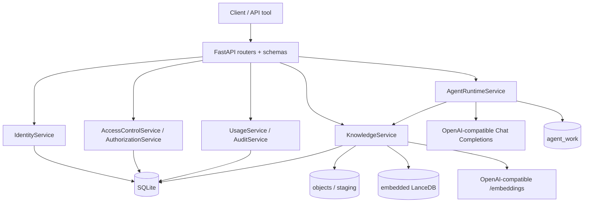

# RunFold Server 开发维护文档

本文描述 `package/server_side` 当前已实现的架构、不可破坏的安全边界、开发约定和运行维护流程。内容以当前源代码、`runfold_server/storage/schema.sql`、HTTP schema、测试和运行入口为准；它不是未来规划或版本兼容承诺。

日常启动和可复制的端到端 HTTP 演示见 `../readme.md`。

## 1. 系统定位与边界

RunFold Server 是一个 FastAPI 单体后端，将本地身份认证、能力与文档 ACL、RAG 文档生命周期、OpenAI-compatible embeddings/chat、LanceDB 向量检索和动态多 Agent 运行时装配在同一进程中。

当前边界如下：

- 同一个 `data.directory` 只能由一个 serve 进程使用，且该进程只能有一个 Uvicorn worker；`--workers` 不是 `1` 时入口直接拒绝启动。
- SQLite、对象目录和 embedded LanceDB 共享同一个本地数据根目录，正确性依赖单进程内的索引写锁和启动 reconciliation。
- 上传、抽取、embedding、索引和 Agent run 都在当前 HTTP 请求内同步完成；没有后台任务、SSE 或 WebSocket。
- 没有服务端对话历史或跨请求 Agent 团队恢复。只有 `agent_work/<user_id>` 是按用户持久保存的 Agent 文件工作区。
- 一个部署代表一个组织；没有租户字段、SSO/OIDC、云对象存储、OCR、全文/混合搜索或文档历史版本。
- API 没有 `/v1` 等版本前缀；FastAPI 的 `info.version` 固定为 `unversioned`。
- 数据库没有迁移系统。既有数据库必须与当前唯一的 `schema.sql` 精确匹配，否则启动失败并要求人工重建数据目录。

## 2. 架构与依赖方向



依赖原则：

- `http` 只做协议解析、认证依赖、service 调用和响应映射；业务策略不写在 router。
- `identity` 负责用户、密码、session 和 `AuthContext`；session token 只在登录响应中出现，SQLite 只保存 SHA-256 摘要。
- `access_control` 负责角色、固定 capability、根能力约束和安全审计。
- `knowledge` 独占文档、ACL、对象文件、抽取、分块、embedding、LanceDB、检索和跨存储状态机。
- `usage` 负责限额、月度 token 和请求计数；文档数与存储字节按 `created_by_user_id` 聚合。
- `runtime` 只通过正式 service 使用知识与权限，不直接访问 SQLite、对象目录或 LanceDB。
- 所有 service 和 repository 都由 `bootstrap.py` 手工装配，不使用 ORM、依赖注入框架、消息队列、Unit of Work 或 provider 抽象层。

### 2.1 源码目录职责

| 路径 | 当前职责 |
|---|---|
| `runfold_server/__main__.py` | `serve`、`rebuild-index`、`compact-index` 唯一 CLI 入口和单 worker 校验 |
| `runfold_server/bootstrap.py` | 数据路径、SQLite、身份/RAC、索引恢复、provider client、runtime、router 的唯一装配点 |
| `runfold_server/config.py` | UTF-8 YAML 严格解析、默认值和启动校验 |
| `runfold_server/http/` | FastAPI app、中间件、路由、严格 Pydantic 请求/响应模型 |
| `runfold_server/identity/` | Argon2id 密码、opaque session、认证和 session 撤销 |
| `runfold_server/access_control/` | 固定能力、角色、用户角色、全局授权、安全根规则、审计 |
| `runfold_server/knowledge/` | 文档 ACL、对象存储、抽取、分块、LanceDB、安全检索、恢复与维护 |
| `runfold_server/llm/` | 严格 embeddings HTTP client 和保留 `reasoning_content` 的 chat model |
| `runfold_server/runtime/` | `/root`、动态委派、Tools、Skills、上下文压缩、用户文件工作区 |
| `runfold_server/usage/` | 默认/覆盖限额、用量汇总与入账 |
| `runfold_server/storage/` | SQLite 连接 PRAGMA、精确 schema/seed 校验、唯一 `schema.sql` |
| `tests/` | unit、API、integration、recovery 和可选真实 provider E2E 测试 |

## 3. 启动、配置与装配顺序

### 3.1 配置来源

服务只读取 `--config` 指定的 UTF-8 YAML；省略参数时读取当前工作目录的 `config.yaml`。代码不读取环境变量、`.env`、数据库或 HTTP 请求来覆盖配置。根节点和每个配置组都拒绝未知字段，数值必须是 YAML 数值而不是字符串。

生产配置包含 provider API key；空用户库首次启动时还包含 bootstrap 管理员密码。配置文件不得提交版本控制、写入数据目录或进入普通日志采集。

| YAML 路径 | 规则与用途 |
|---|---|
| `server.host` | 可省略，默认 `127.0.0.1`；不能含空白 |
| `server.port` | 可省略，默认 `8000`，范围 1–65535 |
| `data.directory` | 必需；绝对路径，且不能是文件系统根目录 |
| `cors.allowed_origins` | 必需非空列表；只接受精确 HTTP(S) origin，拒绝 `*`、重复、路径、查询和凭据 |
| `provider.base_url` | 必需绝对 HTTP(S) URL，不能带凭据/query/fragment，路径必须以 `/v1` 结尾 |
| `provider.api_key` | 必需字符串，可为空；embeddings 在非空时发送 Bearer；chat adapter 在空值时以 `agent.model` 作为 client API-key 占位值 |
| `provider.embedding_model` | 当前唯一 embedding 模型 |
| `provider.embedding_dimensions` | 正整数；每个向量响应都按此维度校验 |
| `provider.embed_batch_size` | 正整数；文档分块批量 embedding 大小 |
| `provider.timeout_seconds` | 正有限数；共享的 provider HTTP 超时 |
| `provider.max_retries` | 非负整数；embeddings 对网络错误、429、502/503/504 的重试次数 |
| `agent.model` | 服务端固定 chat model，客户端不能覆盖 |
| `agent.context_window_tokens` | 模型上下文总预算 |
| `agent.provider_concurrency` | embeddings/chat 共享的进程级并发 semaphore |
| `agent.input_tokens` | 单次 Agent 模型调用输入上限 |
| `agent.output_tokens` | 单次组合输出上限 |
| `agent.thinking_tokens` | 思考上限，必须小于 output；可见输出为二者差值 |
| `agent.compression_threshold` | 可省略，默认 `0.8`，必须在 0 和 1 之间 |
| `agent.thinking_level_options` | 可省略；允许 API 选择的标准化小写字符串列表，可为空 |
| `agent.default_thinking_level` | 必需字符串；空字符串表示 provider 默认，否则必须属于 options |
| `rag.chunk_size` | 正整数字符分块上限 |
| `rag.chunk_overlap` | 非负整数且小于 `chunk_size` |
| `rag.upload_max_bytes` | 单文件流式上传上限 |
| `rag.extract_max_characters` | 规范化抽取文本字符上限 |
| `rag.pdf_max_pages` | PDF 页数上限 |
| `rag.docx_max_uncompressed_bytes` | DOCX ZIP 展开后总大小上限 |
| `auth.session_ttl_seconds` | session 有效秒数 |
| `auth.bootstrap_admin` | 仅空用户库必需；含 `username`、`password` |
| `limits.default_*` | 文档数、存储字节、月 embedding tokens、月 Agent tokens 的正整数默认限额 |

额外关系校验：`agent.input_tokens + agent.output_tokens <= agent.context_window_tokens`。运行时的员工总数、最大深度、并行宽度和 LangGraph steps 都从这些预算计算，不另设配置项；预算只能容纳根 Agent 时，运行仍可执行但不能委派员工。

### 3.2 启动顺序

`bootstrap()` 的实际顺序是：

1. 解析配置，创建 `<data.directory>` 及 `objects`、`lance`、`staging`、`agent_work`。
2. 打开 SQLite；每个连接启用 `foreign_keys=ON`、WAL、5 秒 `busy_timeout`、`synchronous=NORMAL`。
3. 空库完整执行唯一的 `storage/schema.sql`；非空库与当前 schema、外键、显式索引、固定 capability、受保护角色及其能力精确比对。
4. 手工装配身份、授权、对象存储和索引；空用户库通过正式 service 创建 bootstrap 管理员并直接分配受保护的 `system_admin`。
5. 校验 `rag_index_settings` 和 Lance `chunks` 的实际 schema。若配置不匹配且存在 ready 文档则拒绝启动；若没有 ready 文档则可本地重建空索引。
6. 在接收流量前执行本地 reconciliation，不调用 provider。
7. 创建共享 `httpx.AsyncClient`、provider semaphore、embeddings client、chat model、Knowledge/Usage/Runtime services、Skills 和 FastAPI app。
8. 运行 readiness 自检后交给一个 Uvicorn worker。

首次成功创建管理员后，应停止服务，删除 YAML 中整个 `auth.bootstrap_admin` 节点，安全销毁或限制旧配置副本，再重启。已有用户时该节点不是必需项；若仍保留，服务只会记录警告，不会再次创建管理员。

## 4. 持久化与数据事实源

```text
<data.directory>/
├─ runfold.sqlite3            # 身份、权限、文档元数据、状态、用量和审计事实源
├─ runfold.sqlite3-wal/-shm   # 运行期间可能存在
├─ objects/<document_id>/
│  ├─ source                  # 当前原始内容
│  └─ extracted.txt           # 当前 source 的派生规范化文本
├─ lance/                     # chunks 向量表；可从 source 重建
├─ staging/<operation_id>/    # 单次同步写操作暂存；启动时整体清空
└─ agent_work/<user_id>/      # 该用户所有父子 Agent 的持久共享工作区
```

权威关系：

- SQLite 是用户、session、角色、能力、ACL 和文档状态的唯一权限事实源。
- `objects/<id>/source` 是当前文档内容事实源；客户端文件名只作展示，不参与路径拼接。
- `extracted.txt` 和 Lance `chunks` 都是派生数据，只在文档 `ready` 时可信。
- LanceDB 不存 ACL、角色、用户名或密钥；搜索只接受服务端生成的授权文档 ID 白名单。
- provider key 只存在于受限 YAML 和进程内存中。

SQLite 表以 `schema.sql` 为准，当前包括 `service_state`、`users`、`roles`、`capabilities`、`auth_sessions`、`user_roles`、`role_capabilities`、`documents`、`document_acl`、`user_limits`、`usage_monthly`、`rag_index_settings` 和 `audit_events`。

LanceDB 只能有一张 `chunks` 表，字段为 `document_id`、`chunk_id`、`ordinal`、`content_hash`、`text` 和固定维度 `float32 vector`。启动会同时验证表名集合、字段、nullability 和 vector 维度。

## 5. 身份、RAC 与文档 ACL

### 5.1 认证

- 用户名创建时转小写，格式为 3–64 个 ASCII 字母、数字、点、下划线或连字符。
- 密码必须 12–256 个字符且不能含控制字符，使用 Argon2id 保存。
- 登录返回高熵 opaque Bearer token；数据库只保存 token 的 SHA-256。
- `AuthContext` 只含 user ID、session ID 和 request ID，不缓存角色/能力。
- session 过期、撤销或用户 disabled 都会立即使认证失败。
- 用户修改密码和管理员重置密码都会撤销目标用户的全部 session。

### 5.2 授权公式

```text
允许文档操作 = session 当前有效
             AND user.status == active
             AND 当前角色能力并集包含全部操作能力
             AND (当前用户/角色 ACL 级别足够 OR 当前访问具有 bypass)
```

ACL 只有 allow，没有 deny；多条用户/角色授权取最高级别：

- `10 READ`：列表、详情、下载、抽取文本和 RAG 检索。
- `20 EDIT`：包含 READ，可改标题、替换内容和 reindex。
- `30 MANAGE`：包含 EDIT，可删除、读取和完整替换 ACL。

上传者会获得直接 MANAGE ACL。`created_by_user_id` 只决定聚合配额归属，不是隐式 owner bypass。没有文档全局能力时返回通用 403；已有全局能力但文档不存在、状态不可见或 ACL 不足时统一返回 `404 document_not_found`。

### 5.3 固定 capability 与默认角色

当前固定 capability 是：

| 类别 | capability |
|---|---|
| 用户 | `identity.user.read`、`identity.user.manage` |
| 角色 | `identity.role.read`、`identity.role.manage` |
| Agent | `agent.run` |
| 文档 | `rag.document.upload`、`rag.document.read`、`rag.document.update`、`rag.document.delete`、`rag.document.acl.manage`、`rag.document.bypass_acl` |
| 检索 | `rag.search` |
| 用量 | `usage.self.read`、`usage.all.read`、`usage.limit.manage` |
| 审计 | `security.audit.read` |

以下根能力即使被人工写入普通角色，也会在运行时从非 `system_admin` 用户的能力集中剥离：`identity.user.manage`、`identity.role.manage`、`rag.document.bypass_acl`、`usage.all.read`、`usage.limit.manage`、`security.audit.read`。

| 默认角色 | 当前 seed 能力摘要 |
|---|---|
| `system_admin` | 全部能力；唯一受保护角色，固定 ID `00000000-0000-4000-8000-000000000001` |
| `knowledge_manager` | Agent、用户/角色读取、完整 RAG 管理和自身用量；仍受 ACL 限制 |
| `contributor` | Agent、上传/读取/更新/检索和自身用量；仍受 ACL 限制 |
| `reader` | Agent、读取/检索和自身用量；仍受 ACL 限制 |

`system_admin` 不可删除、改名或改变其固定能力集合。普通角色不能获得根能力。替换用户角色或禁用用户时，事务必须保证至少还有一个 active 且直接属于受保护角色的系统管理员。

## 6. 文档、索引和检索一致性

### 6.1 支持格式与处理限制

上传只支持：

- UTF-8 `.txt` 和 `.md`；
- 带可提取文本层、未加密且页数不超限的 `.pdf`，不做 OCR；
- 合法 `.docx`，抽取段落与表格文本，并检查 ZIP 展开后总大小。

文件扩展名和魔数同时校验；客户端 MIME 不作为信任依据。空文件或抽取后空文本返回 422，未知格式返回 415，上传/抽取/PDF/DOCX 超限返回 413。上传以 64 KiB 块流式写入 staging，同时计算字节数和 SHA-256。

### 6.2 状态机与可见性

```text
create:          absent -> indexing -> ready | failed
replace/reindex: ready | failed -> indexing -> ready | failed
delete:          ready | failed -> deleting -> absent
startup:         indexing -> failed | absent
                 deleting -> absent
                 broken ready -> failed
```

| 状态 | 列表/详情 | source | extracted | 搜索 | replace/reindex | 删除/ACL |
|---|---|---|---|---|---|---|
| `ready` | 可见 | 可读 | 可读 | 可用 | 可用 | 可用 |
| `indexing` | 按不存在处理 | 禁止 | 禁止 | 禁止 | 禁止 | 禁止 |
| `failed` | 可见并返回脱敏 `index_error` | source 存在时可读 | 禁止 | 禁止 | 可用 | 可用 |
| `deleting` | 对普通 API 和 bypass 都按不存在处理 | 禁止 | 禁止 | 禁止 | 禁止 | 禁止 |

替换、reindex 和删除先观察当前 `content_hash`，提交状态时使用 `BEGIN IMMEDIATE` 和 observed hash 条件更新；并发变化返回 `409 document_changed`。一旦状态已线性化为 `indexing`/`deleting`，即使调用方随后被撤权，系统仍完成或安全收敛该 mutation，但返回数据前会再次验证权限。

跨 SQLite、对象目录和 LanceDB 没有共同事务。失败处理会删除不可信向量和 extracted；source 存在时按 source 重算基础信息并标记 failed，source 不存在时删除文档记录和对象目录。不保留旧对象、旧向量、旧 hash 列或应用内回滚版本。

### 6.3 安全检索链路

`POST /api/rag/search` 的实现顺序为：

1. 在同一 SQLite snapshot 重新验证 session，并要求 `rag.search + rag.document.read`。
2. 读取当前可 READ 且 ready 的文档 ID、hash 和 chunk 数。
3. `document_ids` 省略表示全部授权范围；显式空数组返回 `422 invalid_document_scope`；非空范围混入一个不可见 ID 时整次返回 404。
4. 授权集合为空时直接返回空数组，不调用 embedding 或 LanceDB。
5. 将 query embedding 入账后，按每批最多 100 个授权 ID 构造 Lance pre-filter，各批 top-k 再全局按 distance 合并。
6. 返回前在新事务中重新认证、重新计算能力/ACL/状态/hash，并核对每个 hit 的 ID、hash、ordinal 和重复 chunk。
7. 未知、过期或越权结果 fail closed 为 `503 unsafe_index_result` 并写审计；只有复核后的文本和标题可返回或进入 Agent。

ACL 从不复制到向量库，撤权不需要改写向量；下一请求以及尚未返回的搜索都会重新按 SQLite 事实源复核。

### 6.4 启动 reconciliation

每次 serve 在接收流量前：

- 清空整个 staging；
- 将残留 `indexing` 清理为 failed，若 source 不存在则物理删除；
- 继续完成 `deleting`；
- 检查 ready 文档的 source/extracted、字节数、hash、media type、总 chunk 数和当前 hash chunk 数；异常时清理派生数据并标记 failed；
- 确保 failed 文档没有可查询向量或 extracted；
- 删除找不到对应 ready 文档/hash 的 Lance 孤儿行。

此流程不调用 provider，也不自动产生 embedding 费用。

## 7. Agent Runtime

公开入口只有 `POST /api/agent/runs`。根 Agent 路径固定为 `/root`，它决定是否通过 `delegate_tasks` 创建员工；员工可以继续创建后代。团队、消息和报告只存在于本次同步请求中。

运行限制全部由 `AgentBudget` 派生：

```text
turn_tokens          = input_tokens + output_tokens
agent_slots          = floor(context_window_tokens / turn_tokens)
max_agents_per_run   = agent_slots - 1
max_recursion_depth  = max_agents_per_run
max_parallel_agents  = min(provider_concurrency, max_agents_per_run)
max_steps            = floor(context_window_tokens / (output_tokens - thinking_tokens))
```

当前 Agent 工具分为三组：

- 团队与 Skill：`delegate_tasks`、`message_agent`、`list_team`、`list_skills`、`load_skill`。
- 授权 RAG：`search_knowledge`、`get_document_manifest`、`read_document_text`、`read_chunk_context`、`search_document_text`、`read_document_section`。
- 用户工作区：`write_file`、`read_file`、`read_files`、`list_directory`、`find_files`、`search_files`、`file_info`、`count_text`、`read_file_chunk`、`append_file`、`apply_patch`。

Tool schema 不接受 user ID、角色、能力或 bypass。RAG Tool 每次走正式 KnowledgeService；文件 Tool 只能访问 `agent_work/<user_id>`，拒绝绝对路径、`..` 和符号链接逃逸。根与后代共享同一发起用户的身份范围，子 Agent 不能扩权。

内置 Skills 位于 `runtime/skills/<name>/SKILL.md`，启动时严格验证 UTF-8、目录名和只有 `name`/`description` 的 frontmatter。当前注册 `critical-review`、`product-decision`、`rag-research`。只有已注册的 `/skill-name` 才会从委派任务文本中抽取并注入子 Agent；未知 slash 文本保持原样。

每个 Agent 有独立 `ContextCompressor`。达到 `input_tokens * compression_threshold` 时生成滚动 checkpoint；超大 Tool result 只在模型投影中保留头尾；必要时按完整 tool-call 阶段从最旧处裁剪。原始消息状态不因此被改写。正常 chat 和 checkpoint 都使用共享 provider semaphore、重新验证 `agent.run`/session、检查月额度并按 provider usage 入账。

HTTP 响应只返回 `/root` 的最终 `answer`、最终 `reasoning_content`（provider 没有时为 null）、实际 thinking level、创建员工数和最大深度。员工任务、报告、reasoning、system prompt 与 tool transcript 不返回，也不写日志/审计。

## 8. HTTP 约定与路由清单

除健康检查外，业务路由位于 `/api`。认证使用 `Authorization: Bearer <token>`。JSON 请求模型统一拒绝未知字段；列表参数默认 `limit=50&offset=0`，limit 范围 1–100。上传 multipart 字段数量和名称也精确校验。

成功/错误响应都会带 `X-Request-ID`；客户端可传符合 `[A-Za-z0-9][A-Za-z0-9._-]{0,63}` 的 `X-Request-ID`，否则服务端生成。统一错误体：

```json
{
  "code": "stable_machine_code",
  "message": "safe human message",
  "details": {},
  "request_id": "opaque-request-id"
}
```

当前业务操作：

```text
GET    /health/live
GET    /health/ready

POST   /api/auth/login
POST   /api/auth/logout
GET    /api/auth/me
PUT    /api/auth/password

GET    /api/access/capabilities
GET    /api/access/users
POST   /api/access/users
GET    /api/access/users/{user_id}
PATCH  /api/access/users/{user_id}
PUT    /api/access/users/{user_id}/password
GET    /api/access/users/{user_id}/roles
PUT    /api/access/users/{user_id}/roles
GET    /api/access/roles
POST   /api/access/roles
GET    /api/access/roles/{role_id}
PATCH  /api/access/roles/{role_id}
DELETE /api/access/roles/{role_id}
PUT    /api/access/roles/{role_id}/capabilities

POST   /api/rag/documents
GET    /api/rag/documents
GET    /api/rag/documents/{document_id}
PATCH  /api/rag/documents/{document_id}
GET    /api/rag/documents/{document_id}/content
GET    /api/rag/documents/{document_id}/text
PUT    /api/rag/documents/{document_id}/content
PUT    /api/rag/documents/{document_id}/text
POST   /api/rag/documents/{document_id}/reindex
DELETE /api/rag/documents/{document_id}
GET    /api/rag/documents/{document_id}/acl
PUT    /api/rag/documents/{document_id}/acl
POST   /api/rag/search

POST   /api/agent/runs

GET    /api/usage/me
GET    /api/usage/users/{user_id}
PUT    /api/usage/users/{user_id}/limits
GET    /api/security/audit
```

FastAPI 还提供 `/openapi.json`、`/docs` 和 `/redoc`。没有公开 `/register`、`/chat`、`/tools` 或 `/skills`。

## 9. 用量、限额、审计与日志

当前限额包括：

- 单文件上传 bytes：YAML 全局配置；
- 当前文档数和当前对象 bytes：按不可变 `created_by_user_id` 聚合；
- 每 UTC 自然月 embedding tokens：上传、替换、reindex 和 RAG query；
- 每 UTC 自然月 Agent tokens：根、后代和上下文 checkpoint 全部归发起用户；
- `user_limits` 可对四类用户限额做 nullable 覆盖，null 表示使用 YAML 默认值。

外部调用前只检查“当前累计是否已达限额”，调用后按 provider usage 无条件入账。没有 reservation，因此并发或已在途 graph 可能小幅超过月限额；这是当前明确边界。

审计记录登录、session 撤销、用户/角色/能力/ACL/限额变更、文档 mutation、检索、Agent run、quota 拒绝、bypass 和不安全索引结果。审计 details 会拒绝敏感 key，不保存密码、token、API key、正文、chunk、完整 query、Agent input、回答或 reasoning。审计查询需要根能力 `security.audit.read`，实际仅直接 system_admin 生效。

HTTP 日志记录 request ID、method、route template、status、duration、actor ID 和安全错误码。Authorization、请求 body、query 正文、provider payload/response 不进入访问日志；未处理异常只在受保护服务端日志保留堆栈。

## 10. 开发与变更规则

### 10.1 Schema 和固定数据

- `runfold_server/storage/schema.sql` 是唯一 DDL 和固定 seed 来源；禁止 Alembic、migrations、`IF NOT EXISTS` 或运行时列探测升级。
- 修改 schema 时同时修改 repository/service/tests，并显式重建所有开发数据目录。
- `capabilities.py` 的 `ALL_CAPABILITIES`、`ROOT_CAPABILITIES` 必须与 `schema.sql` 当前 seed 同步。
- 受保护 system_admin 行和能力集合是 immutable seed；启动会精确断言。
- 不保留旧字段、旧 API、旧 fixture 或兼容分支。

### 10.2 新增/修改 HTTP 操作

1. 在对应 `http/schemas` 使用 `StrictModel` 定义 body/response 并设边界。
2. router 只解析协议和调用 service，不复制授权或状态判断。
3. service 在实际事务内 `revalidate` 并要求精确 capability；文档操作再走 `KnowledgeAccessPolicy`。
4. 权限/ACL/限额变更和对应审计必须在同一个 SQLite 写事务。
5. 为允许、无 session、缺 capability、ACL 不足、未知字段和边界值增加 API 测试。
6. 更新本文路由清单和 `examples/api_demo.py` 的 OpenAPI 覆盖集合。

### 10.3 文档/索引流程变更

- 不把外部 HTTP、文件抽取或 Lance 写入包进 SQLite 长事务。
- 任何公开正文读取只允许 ready；failed 只能在 source 存在时下载原文件。
- mutation 必须先准备，再在短事务内用 observed hash 线性化状态，最后收敛到 ready/failed/absent。
- Lance query 必须有服务端白名单 pre-filter；空授权范围不能调用无过滤搜索。
- 新的派生数据必须能从 SQLite + source 重建，并纳入 reconciliation 完整性检查。

### 10.4 验证命令

在 `package/server_side` 下运行：

```powershell
.venv\Scripts\python.exe -m pytest
.venv\Scripts\python.exe -m ruff check .
```

真实 provider E2E 默认跳过；设置 `RUNFOLD_REAL_E2E=1` 后，`tests/integration/test_real_agent_e2e.py` 会真实上传 DOCX、调用 embeddings/search/chat 并产生 provider 用量。只有在明确接受成本和数据外发时才启用。

## 11. 运行部署边界

生产启动应显式给出绝对配置路径：

```text
python -m runfold_server serve --config C:\secure\runfold\config.yaml --workers 1
```

服务必须位于 HTTPS 反向代理后。代理请求体上限至少等于 `rag.upload_max_bytes`，读取/上游超时必须覆盖同步抽取、embedding、索引和 Agent graph 的最坏延迟。不能用增加服务进程或 worker 的方式延长或扩展请求。

provider 会收到经授权发送的抽取正文、RAG query、用户 Agent input、授权检索结果和员工报告。部署方必须将其视为受信任数据处理方，并确认地域、留存、训练使用和访问控制政策。chat provider 必须兼容 Chat Completions，并在 usage metadata 中给出可校验的 input/output/total tokens；reasoning token 明细可选，缺失时按 0 处理。embeddings 必须返回有序 data 和 `usage.total_tokens`。

运行服务的操作系统账号应采用最小权限：可读取 YAML，只能读写 `data.directory`，其他普通用户不能读取 SQLite、objects、lance、staging 或 agent_work。

## 12. 备份、恢复与索引维护

### 12.1 一致性备份

备份必须停服，并把整个 `data.directory` 作为一个一致性单元复制：SQLite 主文件及仍存在的 WAL/SHM、`objects`、`lance`、`staging` 和 `agent_work`。只备份其中一个存储不能恢复一致状态。

YAML 配置通过单独的受限秘密备份流程保存，不要与数据快照混放。恢复时停服整体还原数据目录，再启动一次让 reconciliation 完成本地收敛；该过程不调用 embeddings。恢复后检查 `/health/ready`、文档可见状态和受权检索，再开放流量。

### 12.2 重建索引

embedding base URL 身份、model、dimensions、chunk size 或 overlap 改变时，先停止 serve，再运行：

```text
python -m runfold_server rebuild-index --config C:\secure\runfold\config.yaml --actor <username> --workers 1
```

`--actor` 必须是当前 active 且直接属于受保护 system_admin 的用户名。命令会：把有 source 的 ready/failed 文档置为 indexing、写入新索引设置、重建唯一 chunks 表、逐文档重新抽取/embedding/写索引，并把 embedding 用量和审计归给 actor。单文档失败会清理派生数据并标记 failed，继续后续文档。

该命令会外发文档并产生费用。中断后不要直接假设索引完整；正常启动会将残留 indexing 收敛为 failed，之后可以再次停服重建。

### 12.3 回收 Lance 空间

先停止 serve，再运行：

```text
python -m runfold_server compact-index --config C:\secure\runfold\config.yaml --workers 1
```

命令要求当前 SQLite index settings 与 Lance schema 完全匹配，然后对 `chunks` 调用 Lance optimize 并立即清理旧数据。`rebuild-index`、`compact-index` 和 serve 都没有跨进程锁，必须由运维保证互斥。

## 13. 已知约束与故障判断

- readiness 只检查本地 SQLite schema/quick check、数据目录可读写和 Lance schema，不主动探测 provider；provider 故障通常在上传、搜索或 Agent run 时暴露。
- SQLite WAL 和 embedded LanceDB 适合当前单实例规模；没有横向扩展保证。
- 文档撤权只能阻止之后的服务器读取/检索，无法使已经返回的数据被用户遗忘。
- 模型可能凭预训练知识生成与受限文档相同的公开事实；系统保证受限文档不被未授权检索和注入上下文，不保证回答事实的唯一来源。
- PDF 没有 OCR；语义搜索零结果不能证明扫描图像或完整源文件中绝对不存在某内容。
- section 识别对 PDF/DOCX 是启发式；完整核对必须用 manifest + 连续全文读取。
- 单次在途 provider 调用可能使月额度轻微超限；没有 reservation 或退款机制。
- SQLite schema、固定 capability、受保护角色或索引配置不兼容时应 fail closed；不要通过手工改库绕过启动检查。

## 14. 维护检查清单

每次合并 server-side 变更前确认：

- [ ] router 没有业务/授权重复逻辑，repository 只做参数化 SQL；
- [ ] session、能力、文档 ACL 和状态在正确事务内重新读取；
- [ ] 无权与不存在文档不会通过状态码、total、错误、日志或候选数量泄漏；
- [ ] 写链路失败不会留下可见 indexing/deleting 或可查询旧向量；
- [ ] schema、固定 seed、源码、OpenAPI、Demo 和测试保持同步；
- [ ] 没有新增 migration、兼容分支、旧实现或无调用方抽象；
- [ ] 日志、错误和审计不含密码、token、key、正文、query、prompt、回答或 reasoning；
- [ ] 全量 pytest 与 ruff 通过；高风险变更补充故障注入或真实 provider 验证；
- [ ] 同一数据目录仍只由一个 serve 进程/一个 worker 使用，备份与索引维护流程未被破坏。
