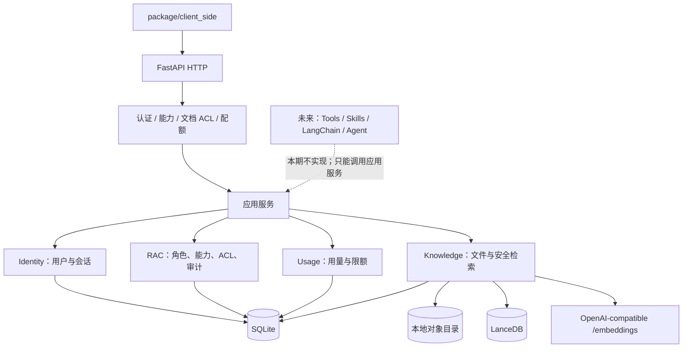

# RunFold Server Side 基础设施开发文档

> 本文是 `package/server_side` 从空目录开始开发时的唯一基础设施交接规范。接手的 AI Agent 应先完整阅读本文，再按里程碑顺序实现；不要自行扩展首期范围。
>
> 本文把原架构图中的 **RAC** 明确定义为 **Role–Assignment–Capability（角色—成员关系—能力）** 管理。实际授权模型是“能力增强 RBAC + 文档 ACL”：角色决定用户能做什么，文档 ACL 决定用户能对哪份文档做，二者必须同时满足。

## 0. 背景
这是一个企业用rag+ai agent一体的项目，主要架构是package/client_side作为harness，向上负责用户对话管理、上传文件到RAG、查看RAG文件、与LLM对话，向下负责tool call，skill call，多agent编排，以及与LLM后端通信。
package/server_side作为项目的后端，结构如下：

flowchart TB
    UI["前端"] --> API[HTTP]
    API --> Gate[登录认证、权限控制、配额检查]
    Gate --> App["应用服务层"]

    App --> RAC["RAC 管理"]
    App --> Knowledge["文件与检索"]
    App --> Runtime["Agent 运行"]
    App --> Usage["用量与限额"]

    RAC --> DB[("关系数据库")]
    Knowledge --> Object[("对象存储")]
    Knowledge --> Vector[("向量索引")]
    Runtime --> LC["LangChain / LangGraph"]

    LC --> Tools["受权限约束的 Tools"]
    Tools --> RAC
    Tools --> Knowledge
    Usage --> DB

## 1. 目标、边界与完成定义

### 1.1 首期目标

在 `package/server_side` 内实现一个 Python + FastAPI + SQLite 的单进程、单部署单元后端，向 `package/client_side` 提供：

- HTTP 基础设施、统一错误、健康检查、请求 ID 与结构化日志；
- 本地账号登录、会话、用户、角色、固定能力目录与文档级授权；
- RAG 文件上传、授权列表、详情、原文件下载、抽取文本查看、元数据修改、完整内容替换、删除和重建索引；
- 本地磁盘对象存储；
- 通过 OpenAI HTTP 兼容协议调用 embeddings；
- 嵌入式 LanceDB 持久化向量索引及严格按权限过滤的检索；
- 文档、存储和 embedding 用量与限额；
- 安全审计与 SQLite/对象目录/LanceDB 跨存储故障恢复；
- 足以证明权限不泄漏和数据可恢复的自动化测试。

首期完成的判断标准不是“目录和接口已经占位”，而是上述链路可运行、可测试，且未授权文档不会通过列表、详情、文件、抽取文本、检索结果、引用、列表/搜索候选/结果计数、错误或日志泄漏。文档创建者对自己承担的聚合计费用量具有下文明确规定的独立知情权，但该聚合绝不包含文档 ID、标题、状态或内容。

### 1.2 首期明确不做

以下能力全部留空，**不创建占位模块、空接口、抽象基类、假实现或返回伪数据的路由**：

- Tools 与 tool call；
- Skills 与 skill call；
- LangChain、LangGraph；
- Agent、子 Agent、多 Agent 编排；
- LLM 对话、流式输出、会话记忆与 prompt 管理；
- Agent Runtime API。

同样不做：多租户、组织树、SSO/OIDC、云对象存储、OCR、图像/音频检索、异步任务系统、多进程或多副本部署、全文/混合搜索、语义缓存、文档历史版本、自动备份恢复。

首期按“一个部署对应一个企业/组织”设计。以后若明确要求多租户，必须重新设计数据隔离边界；现在不要提前给所有表增加无调用方的 `tenant_id`。

### 1.3 将来 Runtime 的接入边界

未来 Agent 只能调用本期已经存在的应用服务，不能直连 SQLite、对象目录或 LanceDB。未来运行时必须满足：

- Agent 使用服务端注入的、不可由模型修改的 `AuthContext`；
- Tool/Skill 参数中不得接受 `user_id`、角色、能力或管理员标记；
- 子 Agent 的授权范围只能等于发起用户范围或更窄，不能做并集；
- 送给 LLM 的 RAG chunk 与引用必须经过本期的同一授权入口；
- 检索内容一律视为不可信数据，不能用文档内容改变权限。

在出现真实 Runtime 调用方前，不实现这些约定对应的代码。

## 2. 不可违反的工程红线

以下规则优先级高于后文任何建议。开发过程中发现冲突时，先删掉越界设计，再继续开发。

1. **分层与内聚**
   - 模块之间分层明确，边界分明，代码干净、整洁、优雅。
   - 同一类业务逻辑只能有一个归属，禁止把权限判断、文档状态流转、配额计算等散落到 router、repository 和适配器中。
   - HTTP 层只做协议转换；repository 只做参数化 SQL；跨 SQLite、对象文件、LanceDB 的流程只由 `knowledge.service` 编排。

2. **不过度工程化，不过度审查**
   - 单进程、单部署单元、一个启动入口、手工装配。这里的“单二进制”指一个可部署服务单元，不要求把 Python 编译为原生可执行文件。
   - **禁止** ORM、DI 框架、微服务拆分、消息队列。
   - 不引入通用 Repository 基类、Unit of Work 接口、Provider 接口、事件总线、策略 DSL、插件框架或只有一个实现的存储抽象。
   - FastAPI `Depends` 只可用于请求级参数/身份提取，不得用于组装业务对象；业务对象在 `bootstrap.py` 中手工创建并传给 router factory。
   - 不写“为了对称”的代码：没有调用方的导出函数删掉；没有第二个实现的抽象层删掉。
   - 对罕见边界情况，若兜底代价高到需要打穿架构或贯穿多个文件，仅在 `docs/` 记录情况、影响、当前缓解和暂不处理理由，把选择权交给后续开发者。

3. **不做版本与迁移**
   - 不做版本控制，不做版本号，不做数据库迁移；全项目有且只有一个 SQL 建库脚本。
   - 不初始化或操作版本控制系统，不增加 Git 工作流。
   - 不定义产品版本、API 版本、Schema 版本或文档修订号；HTTP 路由禁止 `/v1` 一类版本前缀。FastAPI/OpenAPI 若强制要求 `info.version`，固定填写字符串 `unversioned`，它不是版本承诺。
   - 第三方依赖锁定值只用于可复现安装，不属于产品版本。
   - 不做数据库迁移，不使用 Alembic，不创建 migrations 目录，不探测旧字段后升级。
   - 全项目有且只有 `runfold_server/storage/schema.sql` 一个建库脚本。Schema 改动时直接同步修改该文件、当前代码和当前测试；现有开发数据由开发者显式重建。

4. **绝不保留旧实现**
   - 开发过程中严禁留下任何旧代码、旧兼容或只服务于已弃用版本的实现。
   - 需求替换一项能力时，旧字段、旧类型、旧分支、旧表、旧 API、旧测试夹具和无调用方代码必须同步删除。
   - 禁止以“以后可能迁移”“暂时兼容”为由保留死代码。
   - 不实现任何旧版本识别、转换、兼容或回退路径。
   - 文档内容替换只保留当前内容；不得建立 revision 表、旧对象目录、旧向量集合或回滚分支。操作期的 `staging` 临时文件在成功、失败或恢复后立即删除，不属于版本历史。

5. **默认拒绝与零披露**
   - SQLite 是身份、能力、ACL 和文档状态的唯一权限事实源；LanceDB、客户端和未来 LLM/Agent 都不能决定权限。

## 3. 总体架构



### 3.1 权威数据与派生数据

| 数据 | 权威位置 | 说明 |
|---|---|---|
| 用户、会话、角色、能力、用户角色 | SQLite | 每个请求实时读取，不在 token 中固化权限快照 |
| 文档元数据、当前状态、ACL | SQLite | 权限判断的唯一事实源 |
| 当前原始文件 `source` | 本地对象目录 | 文档内容唯一事实；路径只由服务端文档 ID 生成 |
| 当前抽取文本 `extracted.txt` | 本地对象目录 | 由当前 `source` 生成的派生数据，仅 ready 时可读 |
| chunk 文本与向量 | LanceDB | 可由当前对象重建的派生数据，不保存 ACL |
| LLM/embedding 密钥 | 受限权限 YAML 配置文件 | 不写入数据库、响应、日志或审计 |

SQLite、文件系统和 LanceDB 无法共享一个 ACID 事务。系统使用“先使文档退出可检索状态、再修改派生存储、最后标记 `ready`”的状态机和启动恢复获得可恢复一致性；禁止用消息队列或伪分布式事务解决。

### 3.2 依赖方向

```text
http -> identity / access_control / knowledge / usage
knowledge -> identity / access_control / usage / llm.openai_embeddings / storage
identity -> storage
access_control -> storage
usage -> storage
llm.openai_embeddings -> config
storage -> 标准库 sqlite3 / schema.sql
```

- `http` 不含业务策略，只校验请求、让 `identity` 验证 session 并生成不可变 `AuthContext`、调用 service、映射响应/错误。`AuthContext` 只携带当前请求的 user/session/request ID，不携带可陈旧的角色或能力快照。
- `identity` 只负责账号、密码和 session 生命周期；只有它读取 session token 并判定用户是否 active。它提供有真实长操作调用方的 `revalidate(AuthContext)`，在新数据库快照中核验 context 的 session ID 与 user ID 匹配、未撤销、未过期且用户仍 active。
- `access_control` 集中负责角色、全局能力、安全根能力规则与安全审计；其 `AuthorizationService` 接受已经认证的 `AuthContext`，不再次实现 session 验证。
- `knowledge` 独占 `documents`、`document_acl`、资源级授权、授权列表/总数/搜索白名单 SQL，以及上传、替换、删除、抽取、分块、embedding、LanceDB 和恢复流程。文档 ACL SQL 不得出现在 `access_control.repository`。
- `usage` 集中负责限额读取、检查和用量入账。
- repository 允许返回内部记录，但不得自行决定全局能力；文档资源判断只由 `knowledge.access_policy` 组合全局能力检查与本模块 ACL 查询，router 不得复制规则。
- LanceDB 适配器只接受服务端生成的已授权文档 ID 集合，不接受客户端原始 filter。

## 4. 建议目录结构

实现时从最小可运行集合开始创建文件。树中标为“按需”的文件只有出现真实调用方时才创建。

```text
package/server_side/
├─ 基础设施开发文档.md
├─ config.example.yaml              # YAML 配置模板；真实 config.yaml 不提交
├─ pyproject.toml                    # 仅工具配置；不声明产品版本
├─ requirements.txt                 # 运行依赖，固定解析结果
├─ requirements-dev.txt             # 测试/静态检查依赖
├─ runfold_server/                   # 可由 python -m runfold_server --config <path> 启动
│  ├─ __init__.py
│  ├─ __main__.py                    # 唯一入口；serve/维护命令仍属于同一入口
│  ├─ bootstrap.py                   # 唯一手工装配点
│  ├─ config.py                      # YAML 配置解析与启动校验
│  ├─ errors.py                      # 业务错误类型和安全错误码
│  ├─ observability.py               # request_id、结构化日志、敏感字段清理
│  ├─ http/
│  │  ├─ app.py
│  │  ├─ auth_context.py
│  │  ├─ schemas/
│  │  │  ├─ auth.py
│  │  │  ├─ access_control.py
│  │  │  ├─ documents.py
│  │  │  └─ usage.py
│  │  └─ routers/
│  │     ├─ health.py
│  │     ├─ auth.py
│  │     ├─ access_control.py
│  │     ├─ documents.py
│  │     ├─ search.py
│  │     ├─ usage.py
│  │     └─ audit.py
│  ├─ identity/
│  │  ├─ models.py
│  │  ├─ repository.py
│  │  ├─ passwords.py
│  │  └─ service.py
│  ├─ access_control/
│  │  ├─ capabilities.py             # 固定能力代码常量
│  │  ├─ models.py
│  │  ├─ repository.py
│  │  ├─ authorization.py            # 角色、全局能力与安全根规则
│  │  ├─ audit.py
│  │  └─ service.py                  # 用户角色与角色能力管理
│  ├─ knowledge/
│  │  ├─ models.py
│  │  ├─ repository.py
│  │  ├─ access_policy.py             # 文档 ACL 与资源级授权唯一入口
│  │  ├─ object_store.py
│  │  ├─ extractors.py
│  │  ├─ chunker.py
│  │  ├─ lance_index.py
│  │  ├─ reconciliation.py
│  │  └─ service.py
│  ├─ llm/
│  │  └─ openai_embeddings.py        # 当前唯一真实 LLM 侧调用方
│  ├─ usage/
│  │  ├─ models.py
│  │  ├─ repository.py
│  │  └─ service.py
│  └─ storage/
│     ├─ sqlite.py                   # 连接、PRAGMA、短事务
│     └─ schema.sql                  # 全项目唯一建库脚本
├─ tests/
│  ├─ unit/
│  ├─ api/
│  ├─ integration/
│  └─ fixtures/                     # 只保留当前测试使用的最小样本
└─ docs/                             # 仅在确有已知限制要记录时创建
```

首期禁止创建 `agent/`、`runtime/`、`tools/`、`skills/`、`langchain/`、`providers/`、`interfaces/`、`migrations/` 等占位目录。

运行数据不放进代码目录：

```text
<APP_DATA_DIR>/
├─ runfold.sqlite3
├─ objects/<document_id>/
│  ├─ source                       # 当前原始内容，不使用客户端文件名作路径
│  └─ extracted.txt                # 当前规范化抽取文本
├─ lance/                           # LanceDB 本地目录
└─ staging/                         # 单次操作临时目录，必须可清理
```

## 5. 技术选择与进程模型

- Python 采用当前团队认可且仍受支持的解释器；首期以 Python 3.12+ 语法为基线。
- FastAPI + Uvicorn，强制单 worker。多个 Uvicorn worker 或多副本会破坏进程内索引写锁与启动恢复假设，首期必须启动失败或明确拒绝该配置。
- SQLite 使用标准库 `sqlite3` 和参数化 SQL，不使用 ORM。
- LanceDB 使用 OSS embedded 模式并指向 `APP_DATA_DIR/lance`。官方文档确认该模式在进程内、可直接连接本地路径，并支持 metadata pre-filter。
- OpenAI 兼容调用使用一个共享的 `httpx.AsyncClient`；不引入厂商 SDK，不为“供应商”做多实现抽象，因为所有供应商使用相同 HTTP 协议。
- 密码使用 Argon2id；session 使用高熵不透明 token，数据库只保存 token 的 SHA-256 摘要。
- 首期文件解析仅支持 UTF-8 `.txt`、`.md`、带文本层的 `.pdf` 和 `.docx`。PDF 不做 OCR；DOCX 读取段落和表格文本；空文本返回 `422`；其他类型返回 `415`。
- 对上传文件实施字节上限、PDF 页数上限、DOCX 解压后总大小上限和抽取字符上限。限制值来自配置，不把客户端 MIME 当可信依据。
- 依赖首次选定后写入依赖文件的固定解析结果。不要在本文预设库版本，也不要借更新依赖保留旧 API 兼容分支。

## 6. 启动配置与装配

### 6.1 YAML 配置文件

唯一配置来源是启动参数 `--config <path>` 指定的 UTF-8 YAML 文件；未指定时读取当前目录的
`config.yaml`。禁止从环境变量、`.env`、数据库或客户端请求补充或覆盖配置。YAML 根节点及每个分组都
拒绝未知字段，数值使用 YAML 数值类型，不接受用字符串伪装的数值。仓库只提交
`config.example.yaml`，真实配置文件必须限制文件权限且不得提交版本控制。

| YAML 路径 | 必需 | 含义 |
|---|---:|---|
| `server.host` | 否 | 监听地址，默认 `127.0.0.1` |
| `server.port` | 否 | 监听端口，默认 `8000` |
| `data.directory` | 是 | SQLite、objects、LanceDB、staging 的唯一绝对数据根目录 |
| `cors.allowed_origins` | 是 | 精确 CORS origin YAML 列表；带认证时禁止 `*` |
| `provider.base_url` | 是 | OpenAI 兼容根地址，规范化后必须以 `/v1` 结尾 |
| `provider.api_key` | 是 | 可为空字符串；非空时发送 Bearer |
| `provider.embedding_model` | 是 | 当前索引唯一使用的 embedding 模型 |
| `provider.embedding_dimensions` | 是 | 期望向量维度；每个响应都要校验 |
| `provider.embed_batch_size` | 是 | 单次 `/embeddings` 的 chunk 数 |
| `provider.timeout_seconds` | 是 | 连接与响应超时 |
| `provider.max_retries` | 是 | 对网络错误、429、502/503/504 的有限重试次数 |
| `rag.chunk_size` | 是 | 规范化字符分块大小 |
| `rag.chunk_overlap` | 是 | 相邻块重叠；必须小于 chunk size |
| `rag.upload_max_bytes` | 是 | 单文件上传上限 |
| `rag.extract_max_characters` | 是 | 单文档抽取文本上限 |
| `rag.pdf_max_pages` | 是 | PDF 页数上限 |
| `rag.docx_max_uncompressed_bytes` | 是 | DOCX 解压总量上限 |
| `auth.session_ttl_seconds` | 是 | session 有效期 |
| `auth.bootstrap_admin` | 空库必需 | 含 `username` 与 `password`；仅首次创建管理员 |
| `limits.default_max_documents` | 是 | 用户默认当前文档数限额 |
| `limits.default_max_storage_bytes` | 是 | 用户默认当前对象字节限额 |
| `limits.default_monthly_embedding_tokens` | 是 | 用户每自然月 embedding token 限额 |

当前没有 LLM chat 调用方，因此不要提前增加 chat model、temperature、system prompt 等未使用配置。
密钥不得写入 SQLite、LanceDB、对象元数据、日志、审计或异常正文。

### 6.2 启动顺序

`bootstrap.py` 必须按以下顺序手工装配：

1. 解析并完整校验配置：URL、路径、正整数、`overlap < size`、CORS、数据目录不得互相覆盖。
2. 创建数据根目录下的 `objects`、`lance`、`staging`；拒绝对象路径逃逸数据根目录。
3. 打开 bootstrap SQLite connection，**先**执行 `foreign_keys = ON`、WAL、合理的 `busy_timeout`、`synchronous = NORMAL`，再做任何 DDL/seed。此后每个新连接都执行同样 PRAGMA；写事务保持短小，不跨文件解析或外部 HTTP。
4. 若 SQLite 文件不存在，或 `sqlite_master` 中完全没有任何应用表，完整执行一次 `schema.sql`；只要已经存在任一应用表，就绝不对该文件执行 DDL。对既有数据库做“当前结构精确断言”：当前表、列、显式索引、固定能力集合和受保护角色必须与当前代码期望完全相等，任何多余或缺失项都启动失败并提示人工重建。实现可把当前 `schema.sql` 执行到内存 SQLite 后读取其 manifest，与磁盘库的 `sqlite_master`/PRAGMA 和固定 seed 比较，避免维护第二份 Schema 描述。该检查只有成功/失败，不识别旧版本、不转换、不回退。
5. 手工创建 password hasher、具体 SQLite repositories、对象存储、Lance adapter、进程内索引写锁，以及只依赖本地资源的 reconciliation service；此时还不创建 router，也不发送 HTTP。
6. 创建正式 `IdentityService`、`AccessControlService` 和其审计依赖。全新数据库中由 `schema.sql` 写入固定能力与默认角色；用户表为空时，通过正式 service/repository 方法在同一事务创建首个用户、分配受保护 system_admin 角色并写审计，禁止在 `bootstrap.py` 内直接写密码或手写业务 SQL。成功后要求运维从 YAML 删除 `auth.bootstrap_admin`，限制旧配置副本的访问，并重启服务。
7. 校验 SQLite `rag_index_settings`、当前启动配置和 Lance `chunks` 的**实际字段及 fixed vector 维度**。若任一不匹配且仍有 ready 文档，`serve` 启动失败并提示停服运行 `rebuild-index`；若没有 ready 文档，可在本地删除并按当前配置重建空 `chunks` 表、更新 settings，然后继续，绝不调用 embedding。
8. 在接收流量前运行 reconciliation：它只做本地收敛，把 indexing 变为 failed/absent、完成 deleting、清理孤儿；绝不调用外部 embedding 服务。
9. 创建共享 `httpx.AsyncClient`、embedding client、其余 usage/knowledge services、router factories 和 FastAPI app；不使用 DI 容器。
10. 启动一个 Uvicorn worker。

启动时只校验供应商配置格式，不主动发送付费 embedding 请求，也不为中断文档自动重建向量。`/health/live` 只表示进程存活；`/health/ready` 只有在 SQLite、对象目录、LanceDB、索引配置和本地恢复流程均可用时返回成功，且不向匿名调用方暴露内部路径或供应商信息。第二次启动复用既有数据库仅指当前 `schema.sql` 从未改变；Schema 改动后必须由开发者显式重建当前数据库。

## 7. SQLite 数据设计

### 7.1 建库规则

- `schema.sql` 使用普通 `CREATE TABLE`/`CREATE INDEX` 和固定 seed；不要用 `IF NOT EXISTS` 伪装迁移。
- 不创建 `schema_version`、`migration_history` 或兼容标记。
- 所有外键显式定义，连接必须开启 foreign keys。
- 外部资源 ID 使用服务端生成的随机 UUID 文本；客户端不得指定。
- 时间使用应用生成的 UTC ISO-8601 文本，字段统一 `created_at`、`updated_at` 等；不混用本地时区。
- SQLite 中的枚举值均用 `CHECK` 约束。
- 查询字符串放在对应 repository，建表/索引/固定 seed 只能放在唯一 `schema.sql`。

### 7.2 表清单

| 表 | 关键字段与约束 | 责任 |
|---|---|---|
| `users` | `id`, `username UNIQUE`, `display_name`, `password_hash`, `status(active/disabled)`, timestamps | 本地账号；禁用而非硬删，以保留审计外键 |
| `auth_sessions` | `id`, `user_id`, `token_hash UNIQUE`, `expires_at`, `revoked_at`, `created_at` | 不透明 session；token 本身只返回一次 |
| `roles` | `id`, `name UNIQUE`, `description`, `is_protected`, timestamps | 无继承、无父角色；系统管理员角色受保护 |
| `capabilities` | `code PRIMARY KEY`, `description` | 固定能力目录，只能随当前代码与建库 SQL 同步修改 |
| `user_roles` | `(user_id, role_id) PRIMARY KEY`, `assigned_by_user_id`, `created_at` | 用户可拥有多个角色；不支持用户直授能力 |
| `role_capabilities` | `(role_id, capability_code) PRIMARY KEY` | 角色的能力集合 |
| `documents` | 见下节 | 当前文档元数据与索引状态 |
| `document_acl` | `document_id`, `user_id NULL`, `role_id NULL`, `access_level`, `granted_by_user_id`, `created_at` | 用户或角色的文档 allow 授权 |
| `user_limits` | `user_id PRIMARY KEY`, 三类可空覆盖限额, `updated_by_user_id`, `updated_at` | 空值使用启动默认值 |
| `usage_monthly` | `(user_id, month_utc) PRIMARY KEY`, `embedding_tokens`, `search_requests`, `uploads`, `updated_at` | 月度聚合，不记录 prompt/chunk |
| `audit_events` | `id INTEGER PRIMARY KEY`, actor, action, decision, resource type/id, reason, request_id, `details_json`, `created_at` | 安全审计；正文和密钥禁止入库 |
| `rag_index_settings` | 单行约束, `embedding_identity`, `model`, `dimensions`, `chunk_size`, `chunk_overlap`, timestamps | 描述当前可用索引配置，不是版本号 |

`embedding_identity` 是服务端对“规范化 base URL + NUL + model + NUL + dimensions”计算的 SHA-256，用来防止名称相同但来源/维度不同的模型混入同一索引；API key 不参与且绝不持久化。它是配置身份校验值，不是版本号。

`documents` 至少包含：

```text
id
title
created_by_user_id
original_filename
media_type
storage_key
byte_size
content_hash             # 当前 source 的 SHA-256
extracted_characters
chunk_count
index_state              # indexing | ready | failed | deleting
index_error              # 已脱敏的短错误；不得含正文/路径/供应商响应
created_at
updated_at
```

不要增加 revision、generation、legacy state 或 soft-delete 字段。删除完成后物理删除 `documents` 记录；审计事件独立保留。

`document_acl` 必须保证授权主体恰好一个：

```sql
CHECK (
  (user_id IS NOT NULL AND role_id IS NULL)
  OR
  (user_id IS NULL AND role_id IS NOT NULL)
)
CHECK (access_level IN (10, 20, 30))
```

并通过两个 partial unique index 防止重复：

```sql
CREATE UNIQUE INDEX uq_document_acl_user
ON document_acl(document_id, user_id)
WHERE user_id IS NOT NULL;

CREATE UNIQUE INDEX uq_document_acl_role
ON document_acl(document_id, role_id)
WHERE role_id IS NOT NULL;
```

至少为 session hash/expiry、用户角色反向查询、角色能力、文档状态/创建人/创建时间、ACL 的 document/user/role、月度用量建立真实查询需要的索引；不要为了“看起来完整”创建无查询调用方的索引。

### 7.3 LanceDB 表

LanceDB 只建一个 `chunks` 表：

```text
document_id       string
chunk_id          string      # 当前文档内稳定、服务端生成
ordinal           int
content_hash      string
text              string
vector            fixed-size float vector
```

- ACL、用户名、角色和密钥绝不复制到 LanceDB。
- embedding 由 `openai_embeddings.py` 显式生成并以向量搜索调用，避免 LanceDB 自动 embedding 注册表引入第二套供应商配置。
- 每次启动同时检查 SQLite `rag_index_settings` 与 Lance `chunks` 的实际字段、非空约束和 fixed vector 维度，不能只相信 settings 行。
- 查询必须使用 metadata **pre-filter**，限制在服务端计算的文档 ID 白名单内；返回后再核验 `document_id + content_hash`。
- 对单文档更新/删除，使用严格校验后由服务端拼出的 document ID predicate；不得拼入用户输入。
- LanceDB 删除在查询语义上立即排除行，但底层文件可能等 compact/cleanup 才释放空间。提供同一 `__main__` 入口下的人工 `compact-index` 维护命令即可，不引入定时器或队列。

## 8. RAC：能力、角色与文档 ACL

### 8.1 授权公式

```text
允许 = session 有效
    AND user.status == active
    AND 用户所有角色的能力并集包含操作所需全部能力
    AND（文档 ACL 达到所需级别 OR 用户有 bypass 能力）
```

默认拒绝；没有角色继承、能力通配符、显式 deny、用户直授能力或外部策略引擎。多个用户/角色 ACL 命中时取最高 `access_level`：

- `10 READ`：列表、元数据、原文件、抽取文本、参与 RAG 检索；
- `20 EDIT`：包含 READ，可改标题/元数据、替换内容、重建索引；
- `30 MANAGE`：包含 EDIT，可删除、查看及完整替换 ACL。

上传新文档无需已有 ACL；成功创建文档记录时必须同时给上传者写入直接 `MANAGE` ACL。`created_by_user_id` 只用于归属、配额和审计，不构成绕过 ACL 的隐式 owner 权限。

### 8.2 固定能力目录

能力代码由 `capabilities.py` 与 `schema.sql` 的 seed 一一对应，API 只读展示，不提供创建/删除能力接口：

| 能力代码 | 含义 |
|---|---|
| `identity.user.read` | 列出/查看用户 |
| `identity.user.manage` | 创建、禁用/恢复用户、管理员重置密码 |
| `identity.role.read` | 查看角色、能力和用户角色 |
| `identity.role.manage` | 创建/修改/删除角色，替换角色能力和用户角色 |
| `rag.document.upload` | 上传新文档 |
| `rag.document.read` | 列表、详情、下载和查看抽取文本 |
| `rag.document.update` | 修改元数据、替换内容、重建索引 |
| `rag.document.delete` | 删除文档 |
| `rag.document.acl.manage` | 查看、授予、撤销文档 ACL |
| `rag.search` | 发起 RAG 检索；还必须有 `rag.document.read` |
| `rag.document.bypass_acl` | 跳过资源 ACL；本身不授予任何具体操作能力 |
| `usage.self.read` | 查看自己的用量与限额 |
| `usage.all.read` | 查看任意用户用量 |
| `usage.limit.manage` | 修改用户限额 |
| `security.audit.read` | 查看安全审计 |

`rag.document.bypass_acl` 必须与具体操作能力同时满足，且每次使用都写审计。例如删除任意文档需要 `rag.document.delete + rag.document.bypass_acl`。

以下是**安全根能力**，首期只允许受保护的 `system_admin` 角色持有：

```text
identity.user.manage
identity.role.manage
rag.document.bypass_acl
usage.all.read
usage.limit.manage
security.audit.read
```

角色能力替换时，只要目标不是受保护的 `system_admin`，请求体中出现任一安全根能力就必须拒绝；普通角色管理员不能把根能力授予自己或其他角色。授权运行时也必须 fail closed：当操作要求任一安全根能力时，`AuthorizationService` 除检查能力外，还必须确认用户当前直接属于受保护的 `system_admin`，即使数据库被人工误写给普通角色也不能生效。`is_protected` 只能由 `schema.sql` seed 写入，不进入任何创建或修改请求 schema。

### 8.3 默认角色

`schema.sql` 初始化以下当前角色；角色没有继承：

| 角色 | 初始能力 |
|---|---|
| `system_admin` | 全部能力，含 bypass；角色本身受保护 |
| `knowledge_manager` | user/role read、upload/read/update/delete/ACL manage/search、self usage；仍受文档 ACL 限制，可读取用户/角色目录以选择授权主体 |
| `contributor` | upload/read/update/search、self usage；仍受 ACL 限制 |
| `reader` | read/search、self usage；仍受 ACL 限制 |

只有 `system_admin` 角色标记 `is_protected=1`：不得删除、改名、改变其固定能力集合，也不得通过普通 role body 创建第二个 protected 角色。其他默认角色与普通角色一致，可按当前需求修改或删除。

只有当前 active 且**直接属于**受保护 `system_admin` 角色的用户可以：替换任何角色的能力、增删 `system_admin` 成员、禁用/重置另一个 `system_admin` 用户。最后管理员约束定义为“变更后至少还有一个 active 用户直接属于受保护的 `system_admin`”，检查与变更必须在同一个 `BEGIN IMMEDIATE` 事务内，防止两个并发请求分别移除最后两个管理员。不要用可复制到普通角色的能力集合代替此根身份检查，也不要引入 `is_superuser` 字段。

### 8.4 操作矩阵

| 操作 | 必需能力 | 最低文档 ACL |
|---|---|---:|
| 上传 | `rag.document.upload` | 无；创建时自动 MANAGE |
| 列表、详情、原文件、抽取文本 | `rag.document.read` | READ |
| 检索 | `rag.search` + `rag.document.read` | READ |
| 改元数据、替换内容、reindex | `rag.document.update` | EDIT |
| 删除 | `rag.document.delete` | MANAGE |
| 查看/替换 ACL | `rag.document.acl.manage` | MANAGE |

有能力但 ACL 不足要拒绝；ACL 足够但没有能力也要拒绝。

非文档路由必须使用以下精确矩阵：

| 操作 | 必需条件/能力 |
|---|---|
| login | 无；校验账号密码，失败写脱敏审计 |
| logout / me / 修改自己密码 | 有效 session；改密码后撤销该用户全部 session |
| 用户列表/详情 | `identity.user.read` |
| 创建、启停、管理员重置密码 | `identity.user.manage`，并执行 system_admin 根身份规则；重置后撤销目标用户全部 session |
| 能力、角色、用户角色读取 | `identity.role.read` |
| 角色 CRUD、角色能力替换、用户角色替换 | `identity.role.manage`，并执行安全根能力与 system_admin 成员规则 |
| 自身用量 | `usage.self.read`；响应遵守下文计数零披露规则 |
| 任意用户内部用量 | `usage.all.read`；该根能力仅 system_admin 持有 |
| 修改限额 | `usage.limit.manage`；该根能力仅 system_admin 持有 |
| 查看审计 | `security.audit.read`；该根能力仅 system_admin 持有 |
| live/ready | 匿名可用，但只返回最小状态，不返回内部诊断 |

每条路由都要有允许与拒绝测试，不能依靠“相邻接口已经鉴权”推断安全。

### 8.5 唯一授权入口

认证与授权只有两段明确职责：

1. HTTP 入口调用 `IdentityService.authenticate(token, request_id) -> VerifiedIdentity`：从 token 摘要查 session，验证未撤销、未过期、用户 active，并生成只含当前 user/session/request ID 的 `AuthContext`。这个首次结果可直接用于请求开始阶段，不立即重复查一次。
2. 长操作进入后续授权阶段时调用 `IdentityService.revalidate(AuthContext) -> VerifiedIdentity`，在新的数据库快照验证 session ID/user ID、撤销、过期与 active 状态。
3. `AuthorizationService.require_capabilities(VerifiedIdentity.user_id, required) -> CurrentAccess` 每次从 SQLite 读取当前角色与能力并检查全部必需能力；返回只在这一次检查内有效的 `CurrentAccess(user_id, role_ids, capabilities, bypass)`。
4. 文档操作再调用 `KnowledgeAccessPolicy.require_document(CurrentAccess, document_id, level)`；由 `knowledge.repository` 用该次 `role_ids` 查询用户直接 ACL 与角色 ACL 的最高级别，并组合第 3 步结果。
5. `CurrentAccess` 不写入 token/`AuthContext`，不跨授权阶段复用，不做跨请求缓存。每次外发前、提交前和返回前都从第 2 步重新开始，因此能看到 session 撤销和角色变化。
6. 只有具体操作能力与 bypass 同时存在时才能跳过 ACL，并写审计。
7. 授权失败时不调用对象存储、解析器或 LanceDB。

提交阶段的 `revalidate`、能力查询、ACL 查询、配额/状态条件更新与审计必须复用同一个具体 `sqlite3.Connection` 和同一个 `BEGIN IMMEDIATE` 事务；repository 方法显式接收该 connection 即可，不为此创建 UnitOfWork 抽象。

长耗时流程不得把请求开始时的授权当作永久授权：发送任何文件/抽取正文给 embedding 供应商前先调用 `identity.service.revalidate(AuthContext)`，再检查当前能力和（已有文档时的）文档 ACL；创建/替换/reindex/delete 真正提交 `indexing/deleting` 状态前，在新的 `BEGIN IMMEDIATE` 短事务中再次 revalidate、授权并提交状态/审计。该状态事务是 mutation 的授权线性化点；一旦成功，后续规则见 9.3。搜索没有 mutation 线性化点，返回前必须开启新的短读事务，先 revalidate session，再重新读取当前角色能力、ACL、文档状态与 hash，不能复用请求开始时的能力集合或旧 SQLite read snapshot。ACL 替换本身在一个短事务内完成授权、写入与审计，不存在跨存储后半段。

按 ID 读取文档时：未登录返回 `401`；缺全局能力返回通用 `403`；有全局能力但文档不存在或不可见统一返回 `404 document_not_found`，不得泄漏存在性。尽量使用一条带 ACL 条件的 SQL 同时判断“可见记录”，不要先查存在再查权限。列表和总数必须由 `knowledge.repository` 先在 SQL 中应用 ACL，再分页；不能取出后由 Python 过滤。

### 8.6 RAG 防越权固定链路

每次搜索必须严格执行：

1. 验证 `rag.search + rag.document.read`。
2. 从 SQLite 计算当前用户可 READ 且 `index_state = ready` 的文档 ID 与当前 `content_hash`。
3. `document_ids` 字段省略表示使用全部当前可读文档；字段存在但为空数组返回 `422 invalid_document_scope`，绝不能把 `[]` 当作全范围。若客户端指定非空范围，逐个验证其在允许集合中；只要混入一个不存在或无权 ID，整次返回通用 `404 document_not_found`，不能静默缩小范围。
4. 没有可读文档时直接返回空结果，绝不能退化成无 filter 搜索。
5. 服务端把允许 ID 生成 LanceDB metadata pre-filter 后再执行向量搜索。ID 数量过多时按服务端批次分别做受限 top-k，再全局按距离合并；不能无过滤召回。
6. LanceDB 返回后，在一个新的短读事务中调用 `identity.service.revalidate(AuthContext)`，重新读取当前角色能力、ACL，并批量核验文档仍为 ready、仍可读、`content_hash` 仍相同。session 已撤销/过期、用户失效或出现未知/越权 chunk 时必须 fail closed、写安全审计，不能静默忽略。
7. 只有复核通过的 chunk、标题、文件元数据和引用可以返回客户端或未来送入 LLM。

权限/ACL 撤销不改写向量。撤销对下一请求立即生效；同一搜索在返回内容前也要做第 6 步复核，尽量阻止请求执行期间发生的撤权继续披露。

## 9. 文件、索引与一致性流程

### 9.1 对象与文本规则

- `original_filename` 仅作展示，先去除路径成分和控制字符；绝不能参与本地路径拼接。
- 对象键固定为服务端生成的 `<document_id>/source` 与 `<document_id>/extracted.txt`。其中 `source` 是当前内容的唯一事实，`extracted.txt` 与 Lance rows 都是可删除重建的派生数据。
- 上传流式写入 `staging/<operation-id>/`，同时计算 SHA-256 和字节数；绝不一次性把任意大文件读入内存。
- `.txt/.md` 只接受 UTF-8；换行规范化为 `\n`。PDF/DOCX 抽取后也生成 UTF-8 规范化文本。
- 默认分块按段落优先、字符上限兜底；空白归一化但不改写原始文件。`ordinal` 从 0 连续递增。
- 不基于 content hash 跨文档去重，也不向用户提示“其他用户已上传相同文件”，避免存在性侧信道。

### 9.2 OpenAI embeddings 调用

`openai_embeddings.py` 只实现当前真实需要的 embeddings：

- `POST {base_url}/embeddings`，请求含 `model` 与批量 `input`；
- API key 非空时发送 `Authorization: Bearer ...`；
- 显式校验 HTTP 状态、响应条数、顺序、数值有限性、每个向量维度和 `usage.total_tokens`；
- 只对连接错误、超时、429、502/503/504 做配置限定的少量指数退避重试；其他 4xx 不重试；
- 供应商原始响应、输入 chunk、API key 不进入日志或客户端错误；
- 实际已发生的 embedding tokens 即使后续索引失败也要计入用量，因为外部成本已经发生；
- 暂不实现 chat completion、responses、streaming 或 provider interface。

配置的 OpenAI-compatible 服务商是企业显式选择的受信任数据处理方，因为抽取后的文档正文会发送给它。RAC 能阻止企业用户越权，不能阻止已配置供应商接收被授权发送的内容；部署者必须自行确认供应商的数据处理、地域与保留策略。

### 9.3 状态机、可见性与并发条件

只允许以下状态转换：

```text
create:          absent -> indexing -> ready | failed
replace/reindex: ready | failed -> indexing -> ready | failed
delete:          ready | failed -> deleting -> physically absent
startup recovery:
                 indexing -> failed，或在 source 不存在时 -> physically absent
                 deleting -> physically absent
                 ready 且完整性异常 -> failed
```

普通 HTTP API 的可见性固定如下；表中的“允许”仍需满足对应能力与 ACL：

| 状态 | list/detail | source 下载 | extracted text | search | replace/reindex | delete/ACL |
|---|---|---|---|---|---|---|
| `ready` | 允许 | 允许 | 允许 | 允许 | 允许 | 允许 |
| `indexing` | 不可见，按不存在处理 | 禁止 | 禁止 | 禁止 | 禁止 | 禁止 |
| `failed` | 允许并显示脱敏状态 | source 存在时允许 | 禁止，不能信任旧派生文本 | 禁止 | 允许 | 允许 |
| `deleting` | 对所有普通 API（包括 bypass）按不存在处理 | 禁止 | 禁止 | 禁止 | 禁止 | 禁止 |

替换、reindex 和删除在准备阶段先记录观察到的当前 `content_hash`。真正切换状态时，必须在重新授权的 `BEGIN IMMEDIATE` 事务中使用类似 `WHERE index_state IN (...) AND content_hash = :observed_hash` 的条件更新；影响行数不是 1 则返回 `409 document_changed`。这里的 hash 是当前内容校验与并发条件，不是版本号，不得为此增加 revision/generation 字段。

一旦操作已经把文档切到 indexing，后续任一步失败都要 best-effort 删除该文档的全部 Lance rows 与不可信 extracted；若 source 存在则按当前 source 重算基础元数据并标记 failed，若 source 不存在则完整清理 document/ACL/对象目录。不得把旧向量重新启用作为回退。

`indexing/deleting` 状态事务是 mutation 的授权线性化点。它提交后，即使 session 被撤销、用户被禁用、角色/能力随后改变，服务也必须继续把已授权 mutation 收敛到 `ready`、`failed` 或物理删除；撤权不是跨存储失败，不能因此回滚 source、恢复旧向量或留下 indexing/deleting。完成后、返回任何文档元数据/正文或成功结果前再次 `revalidate`/授权：若已失权则返回相应 `401/403/404` 且不返回文档数据，但已经线性化并完成的 mutation 不撤销。Search 没有这一线性化点，返回结果前的完整 revalidate 失败时不得返回任何 chunk/引用。

ACL 完整替换只允许 `ready|failed`。允许请求移除最后一个 MANAGE 主体；之后只有仍命中 ACL 的主体或拥有 bypass 的 system_admin 能恢复，不增加难以长期维持的“至少一个有效 MANAGE”规则。

### 9.4 创建文档

1. 鉴权：检查上传能力；读取当前限额。
2. 暂存：流式写 staging，验证类型/大小，计算 hash。
3. 处理：抽取、规范化、分块；失败只清理 staging，不创建文档。
4. 外发前复核：在把抽取正文发送给供应商前重新验证 active session、上传能力与当时的 embedding 额度；这次检查通过后，本次已获准调用不会因自身随后入账而在最终提交时被反向拒绝。
5. Embedding：批量调用供应商，立即记录实际用量。
6. SQLite `BEGIN IMMEDIATE` 短事务：再次验证 active session 与上传能力，重新检查文档数和存储字节配额，但不重复否决已经发生并入账的 embedding；插入包含当前已知 byte/hash/char/chunk 元数据的 `documents(indexing)`、上传者 MANAGE ACL 和操作审计。
7. 对象提交：只把 staged `source` 作为当前内容用一次 `os.replace` 提交；随后提交 staged `extracted.txt`。两者不是一个原子整体，因此 indexing 期间所有正文读取均被禁止，恢复永远以 source 为准。staging 与 objects 必须在同一文件系统。
8. 在进程内索引写锁内，先删除该新 ID 的任何残留行，再写入全部当前 chunks。
9. SQLite 短事务以预期 hash 为条件将文档标记 `ready`。
10. 清理 staging，返回文档。

任何步骤失败都不得把未完成文档标为 ready。数据库记录已创建但恢复无法立即完成时标记 `failed`，只允许有权限用户查看状态、下载、重试 reindex 或删除，不参与检索。

### 9.5 修改、替换与 reindex

- `PATCH` 只修改标题等当前元数据，不触碰内容和索引。
- 内容编辑定义为“完整替换当前内容并完整重建索引”，不做 PDF/DOCX 内部原位编辑。
- 文本类文档可以通过 text API 替换 UTF-8 当前内容；PDF/DOCX 通过 multipart 上传新文件替换。
- 新内容先在 staging 中完成验证、抽取、分块；发送正文给供应商前重新授权，然后完成 embeddings。旧文档在准备阶段仍保持 ready。
- replace 若由文档创建者本人发起，在 embedding 前按 `新 byte_size - 当前 byte_size` 检查其可见的存储额度；负差值直接释放额度。若由其他具有 EDIT 的主体发起，不通过允许/拒绝暴露创建者剩余额度，只应用单文件上限并把新聚合记到创建者名下，允许该次操作使创建者聚合超过限额；创建者后续上传会被拒绝且可在自己的计费用量中看到原因。reindex 不改变存储字节。每个 embedding 批次只在调用前检查当时额度，调用后无条件记录实际 token。
- 准备成功后，在新的 `BEGIN IMMEDIATE` 事务中再次授权并用“允许的旧状态 + observed hash”条件把文档置为 `indexing`；然后只原子替换 source，再替换派生 extracted，删除该文档全部旧向量、写入新向量、更新当前 metadata/hash 并恢复 `ready`。
- 显式 reindex 不替换 source：先读取 observed hash，在外发前重新授权，从 source 重新抽取/分块/embedding；再以同样的条件更新切到 indexing，替换 extracted 与向量并恢复 ready。发起者承担实际 embedding 用量。
- 不保留旧对象、旧抽取文本、旧向量、旧 hash 列或回退路径。

### 9.6 删除

1. 读取 observed hash；在 `BEGIN IMMEDIATE` 短事务内再次检查 active 用户、delete 能力 + MANAGE ACL，并用“ready/failed + observed hash”条件把状态提交为 `deleting`；从此所有普通 API 都按不存在处理。
2. 在索引写锁内删除 LanceDB 中该 `document_id` 的全部行。
3. 删除当前 source、extracted 和空文档目录。
4. 删除 SQLite 文档记录；外键级联删除 ACL。审计记录独立保留。

若中途崩溃，`deleting` 永远不参与检索，启动恢复幂等继续第 2～4 步。

### 9.7 启动恢复与维护

`knowledge.reconciliation` 在开始接流量前执行：

- 启动阶段不存在活跃请求，直接清空整个 staging；不增加 operation 表或“活跃操作记录”；
- `indexing` 且 source 存在：删除该文档全部向量和不可信 extracted，从 source 重新计算 hash/byte/media 元数据，写 `index_state=failed` 与脱敏 `index_error=interrupted`；启动过程绝不调用外部 embeddings；
- `indexing` 且 source 不存在：删除该文档全部向量、extracted、对象目录、ACL 与 document 记录；
- `deleting`：继续删除向量、对象与数据库记录；
- `ready`：至少校验 source/extracted 存在、source hash、Lance chunk 数与 `chunk_count` 一致；异常时删除不可信向量/extracted并标记 failed，不在启动时自动重建；
- 删除 LanceDB 中找不到对应 ready 文档/hash 的孤儿行；即使清理失败，授权白名单与 hash 复核也必须保证这些行永不返回；
- `failed`：确保没有可查询向量，保留 source 与脱敏错误，等待有权限用户显式 replace/reindex/delete，不自动重试。

索引配置改变时禁止混合使用。`rebuild-index` 是**停服维护命令**，要求命令行指定一个当前 active、直接属于 system_admin 的 actor username，embedding 用量与审计归属于该 actor，并执行：

1. `BEGIN IMMEDIATE` 把所有 source 可用的 `ready|failed` 文档置为 indexing，同时写入目标 `rag_index_settings`；source 缺失者直接 failed。
2. 删除并按新维度重建唯一 `chunks` 表，不保留旧表、备用目录或回滚副本。
3. 逐文档从 source 抽取、embedding、写向量并标记 ready；单文档失败则清理其向量并标记 failed，继续其他文档。
4. 命令中断后，下一次启动按普通 indexing 恢复规则把未完成项安全收敛为 failed；管理员可修复后再次停服执行命令或逐文档 reindex。

若命令恰在“写入新 settings”之后、“按新维度重建 chunks”之前中断，下一次启动会看到实际 Lance schema 不匹配且没有 ready 文档：先本地重建当前维度的空表，再把 indexing 文档收敛为 failed。若仍存在任何 ready 文档则不得自动删表，必须启动失败并要求再次停服维护。

`compact-index` 同样只能停服执行，仅调用 LanceDB 官方 compact/cleanup 回收删除片段空间。维护命令与 serve 不并发，因此不需要跨进程锁。

## 10. HTTP API 约定

### 10.1 通用约定

- 本项目 API 不带版本前缀，统一位于 `/api`；健康检查位于 `/health`。
- JSON 使用 UTF-8；时间为 UTC ISO-8601；ID 为 opaque string。
- 登录返回 opaque Bearer token；客户端仅在内存/安全存储中保存。生产必须由反向代理提供 HTTPS。
- 列表统一 `limit`（默认 50，最大 100）和 `offset`，响应为 `items`, `limit`, `offset`, `total`；`total` 必须是授权过滤后的数量。
- 上传不实现 idempotency key；重复成功请求创建两个独立文档。不要跨用户或跨文档自动去重。
- 所有修改请求使用完整、明确的 body。ACL 和角色能力使用 `PUT` 表示“完整替换当前集合”，在一个 SQLite 事务中校验并提交。
- 请求体、文件、查询、分页、top-k 都有明确上限；拒绝未知字段。

统一错误：

```json
{
  "code": "stable_machine_code",
  "message": "safe human message",
  "details": {},
  "request_id": "opaque-request-id"
}
```

`details` 只放安全、可行动的字段级错误；不得包含路径、SQL、token、密码、文档正文、chunk、检索问题、供应商原始响应或堆栈。

### 10.2 路由轮廓

```text
GET    /health/live
GET    /health/ready

POST   /api/auth/login
POST   /api/auth/logout
GET    /api/auth/me
PUT    /api/auth/password

GET    /api/access/capabilities
GET    /api/access/users
POST   /api/access/users
GET    /api/access/users/{user_id}
PATCH  /api/access/users/{user_id}                 # display name / active-disabled
PUT    /api/access/users/{user_id}/password        # 管理员重置
PUT    /api/access/users/{user_id}/roles            # 完整替换
GET    /api/access/roles
POST   /api/access/roles
GET    /api/access/roles/{role_id}
PATCH  /api/access/roles/{role_id}
DELETE /api/access/roles/{role_id}
PUT    /api/access/roles/{role_id}/capabilities     # 完整替换

POST   /api/rag/documents                           # multipart 上传
GET    /api/rag/documents                           # 只列授权文档
GET    /api/rag/documents/{document_id}
PATCH  /api/rag/documents/{document_id}             # 当前元数据
GET    /api/rag/documents/{document_id}/content     # 下载当前原文件
GET    /api/rag/documents/{document_id}/text        # 查看当前抽取文本
PUT    /api/rag/documents/{document_id}/content     # multipart 完整替换
PUT    /api/rag/documents/{document_id}/text        # 仅 txt/md 的 UTF-8 完整替换
POST   /api/rag/documents/{document_id}/reindex
DELETE /api/rag/documents/{document_id}
GET    /api/rag/documents/{document_id}/acl
PUT    /api/rag/documents/{document_id}/acl         # 完整替换 user/role grants

POST   /api/rag/search

GET    /api/usage/me
GET    /api/usage/users/{user_id}
PUT    /api/usage/users/{user_id}/limits

GET    /api/security/audit
```

不创建 `/chat`、`/agent`、`/tools`、`/skills` 或空 Runtime 路由。

### 10.3 RAG search 合约

请求至少包含：

```json
{
  "query": "用户查询",
  "top_k": 8,
  "document_ids": ["可选的显式范围"]
}
```

`document_ids` 必须区分“字段省略”和“显式空数组”：省略表示全部当前可读文档；显式 `[]` 返回 `422 invalid_document_scope`。实现禁止使用 `if document_ids:` 一类会把空数组误判为未指定的分支。

响应只返回授权后的：chunk text、score/distance、document ID、title、ordinal 和当前 content hash；不得返回本地路径、ACL 详情、其他候选数量或被过滤文档数量。搜索 query 参与 embeddings 和用量，但不写日志/审计正文。

## 11. 用量、限额与审计

### 11.1 首期限额

只实现已有真实调用方的限额：

- 单次上传字节上限：启动配置；
- 用户当前文档数量：聚合 `documents.created_by_user_id`，删除后释放；
- 用户当前对象存储字节：聚合当前文档 `byte_size`，替换按新值计算；
- 用户每 UTC 自然月 embedding tokens：上传、替换、reindex、搜索 query 均计入；
- 管理员可在 `user_limits` 覆盖默认文档数、存储字节和月 embedding tokens。

不要提前增加 chat token、tool 次数、agent step 等无调用方字段。每个 embedding 调用/批次只在调用前检查当时额度；调用后无条件用 OpenAI 兼容响应的 `usage.total_tokens` 入账，即使后续索引失败。当前已获准的调用不会因自身入账后使累计值超过限额而被最终事务再次否决，后续调用再拒绝。由于外部调用不能与 SQLite 事务绑定，一个已经在途的请求可能小幅越过月额度；首期接受这一明确限制，不为严格预留引入 reservation 子系统或长事务。

`created_by_user_id` 同时是不可变的文档聚合计费归属。即使创建者后来失去文档 ACL，该文档仍计入其文档数和存储字节额度；创建者通过 `/api/usage/me` 有权看到自己承担的聚合 current/limit/remaining，但只能看到总文档数、总字节数和月 embedding tokens，绝不返回隐藏文档的 ID、标题、状态、hash、类型或分项。这是独立的计费知情权限，而不是 READ ACL；因此本文的零披露承诺明确不包含创建者自己的聚合计费值。只有拥有根能力 `usage.all.read` 的 system_admin 可查看其他用户的完整聚合。

### 11.2 必须审计

- 登录成功/失败、logout/session 撤销；
- 用户创建、启停、密码重置；
- 角色创建/修改/删除、能力集合替换、用户角色替换；
- 文档上传、元数据修改、内容替换、reindex、删除；
- ACL 完整替换，记录主体 ID 与 access level 的安全前后差异；
- RAG 搜索允许/拒绝、授权文档数、最终引用文档 ID；
- 配额拒绝与限额修改；
- 所有 bypass；
- LanceDB 返回未知、hash 不符或越权文档 ID 等安全事件。

权限、角色、ACL、限额变更与其审计记录必须在同一个 SQLite 事务提交。搜索每请求只记一条摘要，禁止逐 chunk 写审计。审计不得保存密码、session token、API key、文件正文、chunk 文本、完整 query、prompt 或模型回答。

审计会包含文档 ID、引用 ID 和 ACL 主体差异，因此审计 API 不按文档 ACL 做复杂过滤，而是只允许直接属于 system_admin、拥有根能力 `security.audit.read` 的用户访问。不得把该能力授予普通角色。

### 11.3 日志

- 每请求生成/接收经校验的 `request_id`，响应回传；
- 结构化记录 method、route template、status、duration、actor ID（认证后）、安全错误码；
- 不记录 Authorization header、multipart body、JSON 正文、query 文本或供应商请求/响应；
- 内部异常保留堆栈到受保护服务端日志，客户端只收到安全错误；
- readiness 失败原因可写日志，但匿名 health 响应不披露路径/密钥/模型。

## 12. 并发、安全和运行约束

- 一个进程内索引写锁串行化 LanceDB 的 add/delete/rebuild/compact；文件解析和远程 embedding 不在锁内，减少长时间阻塞。
- 文档状态变化和 ACL 变化用 SQLite 短事务；更新/删除授权检查与状态写入放在同一事务，防止检查后被换权。
- 上传文件名、标题、用户名等都限制长度并拒绝控制字符；所有 SQL 参数化。
- 对象路径使用服务端 UUID 并在每次文件操作前确认解析后的绝对路径仍位于 `APP_DATA_DIR`。
- 不信任客户端 MIME、LanceDB filter、document ID、chunk ID、token 中的角色声明或未来模型参数。
- CORS 只允许配置的精确 origin；生产 HTTPS、磁盘权限、进程用户和数据备份由部署层负责。
- SQLite 适合当前单进程规模。出现真实写竞争或数据量瓶颈后再评估替换，首期不为假设规模建立数据库接口层。
- 不实现跨用户 RAG 结果缓存。已经返回给用户的内容无法通过之后撤权让用户“遗忘”；系统保证的是撤权后不再从服务器检索、下载或重新披露。
- 模型未来可能凭预训练知识生成与受限文档相同的公开事实；系统只能保证受限文档未被服务器检索并放入上下文，不能证明一句话唯一来自某文档。这是安全边界，不要声称可绝对判源。

## 13. 测试策略与最低安全用例

### 13.1 测试层次

- unit：密码、session hash、能力集合、ACL 等级、chunking、路径校验、错误映射；
- API：真实 FastAPI app + 临时 SQLite/对象目录，覆盖状态码、错误体、分页和权限；
- integration：真实临时 LanceDB + fake OpenAI HTTP transport，覆盖上传—检索—替换—删除；
- recovery：在创建、替换、删除关键步骤注入异常/模拟中断，再启动 reconciliation；
- schema：所有测试数据库只执行生产 `schema.sql`，禁止测试自建另一套 schema。

### 13.2 必须通过的安全用例

1. 有操作能力但无 ACL：拒绝；有 ACL 但无操作能力：拒绝。
2. 用户 ACL 直授与多个角色 ACL 授权取最高级别；ACL 只 allow、无 deny，仍不支持用户直授全局能力。
3. 禁用用户、移除角色、减少角色能力、撤销 ACL/session 后，下一请求立即失权。把撤权时点拆开测：embedding 阻塞且尚未进入 indexing 时撤权，不得提交 mutation；已经进入 indexing、在 fake Lance 写入时撤权，mutation 必须安全收敛但响应不得披露元数据/正文；search 在 Lance 阻塞时撤权，不得返回任何结果。
4. 文档列表、分页、`total`、详情、文件、抽取文本均不泄漏无权文档。
5. 猜测文档 ID 时，无权与不存在均返回同样的 `404 document_not_found`。
6. 显式搜索范围混入无权 ID 时整次失败；字段省略、显式 `[]`、非空数组三种语义分别测试；空授权集合绝不触发无过滤搜索。
7. top-k 全部来自授权且 ready 的文档；只有无权文档含命中词时返回空而不是泄漏。
8. LanceDB 返回未知 ID、旧 hash 或越权 ID 时 fail closed 并审计。
9. ready/indexing/failed/deleting 的每个 API 可见性均符合矩阵；删除先进入 deleting，即使对象或向量残留也无法被列出、读取或检索。
10. 内容替换不保留旧对象/旧向量；新内容无效时旧 ready 内容不受影响。
11. 上传文件名路径穿越、控制字符、超限、伪扩展、空抽取、维度错误均安全失败。
12. session token 数据库泄漏不能直接复用；过期/撤销 token 拒绝；禁用用户的现有 session 立即失效。
13. 安全根能力不能加入普通角色；普通用户不能把自己加入 system_admin、给自己授予 bypass、重置/禁用 system_admin 或读取全局审计。
14. bypass 同时需要具体能力且留下审计；system_admin 成员变更使用 `BEGIN IMMEDIATE`，不能移除最后一个 active system_admin。
15. 密码自改或管理员重置会撤销目标用户全部 session；每条 identity/role/usage/audit 路由都有拒绝测试。
16. 启动恢复不调用 embedding；indexing 收敛为 failed/absent，deleting 幂等完成，旧 extracted/向量不再可信。
17. `/usage/me` 对失去 ACL 的文档只披露创建者独立有权知道的聚合计费值，不含任何文档 ID/标题/状态/分项；非创建者不能用 replace 的允许/拒绝探测创建者剩余额度。
18. 模拟 rebuild 在更新 settings 后、重建 chunks 前中断；下次启动校验实际 vector 维度，在无 ready 文档时重建空表并安全收敛，在有 ready 文档时 fail closed。
19. 日志、错误和审计中不存在 token、密码、API key、正文、chunk 或完整 query。
20. 未来 AuthContext 的 Agent 传播约束测试在 Runtime 真正实现时再增加，首期不写假 Agent 测试。

## 14. 开发里程碑

严格按顺序推进。每个里程碑完成后先删除无调用方代码、跑当前全部测试，再进入下一项；不要同时铺开所有模块。开发期间 `schema.sql` 也只包含当前里程碑已有真实调用方的表/seed；进入下一里程碑时直接修改这唯一脚本并显式重建开发数据库，不预建未来空表，也不写迁移。

### M0：工程骨架、配置与单进程启动

交付：

- 最小目录、依赖文件、`__main__.py`、`config.py`、`bootstrap.py`；
- FastAPI app、统一错误、request ID、日志、live/ready；
- `storage/sqlite.py` 与唯一 `schema.sql`；
- 数据目录初始化、SQLite PRAGMA、基于当前 schema.sql 的精确结构断言、单 worker 约束；
- 不含任何 Agent/LangChain/Tool/Skill 依赖或目录。

验收：空目录可初始化并启动；第二次启动复用当前数据库；结构不兼容直接失败；测试数据库只使用同一 schema.sql。

### M1：Identity 与 RAC

交付：

- Argon2id 密码、opaque session、login/logout/me/change password；
- 用户创建、禁用/恢复、管理员重置密码；
- 固定能力、角色 CRUD、角色能力替换、用户角色替换；
- 在当前唯一 schema.sql 中加入本里程碑实际使用的 identity/RAC 表与固定 seed，并重建开发数据库；
- `AuthorizationService`、安全根能力、管理员 bootstrap、最后 active system_admin 的 `BEGIN IMMEDIATE` 保护；
- 密码变更后的 session 全量撤销，以及 identity/role 路由精确权限矩阵；
- 安全审计基础与权限矩阵测试。

验收：权限在下一请求实时生效；token 不包含权限；受保护角色不可破坏；敏感信息不落日志。

### M2：完整文档写链路、索引与最小恢复

交付：

- `documents`、`document_acl`、`knowledge.access_policy` repository/service；
- txt/md/pdf/docx 验证与抽取、本地对象存储、staging；
- 直接 OpenAI-compatible embeddings 客户端、chunker、Lance `chunks` 表与索引配置检查；
- 上传、授权列表/详情、下载、文本查看、元数据修改、内容替换、reindex、删除；
- user/role ACL 完整替换；
- 文档数/存储字节/embedding token 限额；
- `indexing/deleting/failed` 最小 reconciliation：启动不调用外部服务，indexing 收敛为 failed/absent，deleting 完成删除；
- 路径穿越、授权过滤、供应商响应、状态可见性和中断清理测试。

验收：首次公开文档写 API 时，对象、embedding、LanceDB、状态机与最小恢复已经同时存在，不交付没有索引语义的过渡 CRUD；所有读写路径都经过能力 + ACL；替换后旧 chunk 不可查询；重启不会把中断文档误标 ready。

### M3：安全 RAG 检索

交付：

- `/api/rag/search`；
- SQLite 授权集合、LanceDB pre-filter、批次合并和新事务返回前复核；
- 省略/空/非空 `document_ids` 的精确语义；
- search embedding 用量/限额/审计；
- 零披露安全用例。

验收：只有无权文档命中时结果为空；显式混入无权 ID 整次失败；空数组绝不扩大范围；任何未知/旧 hash chunk 都 fail closed。

### M4：恢复、维护与运行保障

交付：

- ready 完整性检查、孤儿向量清理；
- 停服 `rebuild-index`、`compact-index` 与索引配置变化流程；
- 完整 usage/limits 与仅 system_admin 可见的 audit 查询 API；
- 创建/替换/reindex/删除各步骤的故障注入测试；
- 部署说明：一个进程、一个 worker、数据目录权限、HTTPS/备份和 embedding 供应商信任责任。

验收：在每个跨存储步骤中断后重启，文档要么保持当前 ready，要么安全收敛为 failed/deleted；恢复不产生外部 embedding 费用；任何残留都不可越权查询；维护命令不与 serve 并发。

### M5：收口

交付：

- 运行全部测试、静态检查和最小手工 smoke test；
- 核对 API/OpenAPI 不含版本路由和空 Runtime；
- 删除所有无调用方 export、重复判断、过期 fixture 与临时代码；
- 只把确实存在且高代价的已知限制记录到 `docs/`。

验收：当前代码、唯一 schema、API、测试与本文完全一致；不存在过渡实现、空占位、旧兼容或未说明的权限分支。

最终验收命令由实现时的依赖工具确定，但至少应有等价能力：

```text
python -m pytest
python -m ruff check .
python -m runfold_server --config config.yaml
```

## 15. 关键取舍与禁止“顺手优化”的事项

- **跨存储非事务性**：用状态机、隐藏未就绪文档、幂等恢复解决；不加队列、outbox、分布式事务。
- **单进程**：当前正确性依赖一个 worker 和进程内索引锁；不写多进程锁或 leader election。
- **ACL 不复制到向量库**：权限撤销实时、逻辑单一；大量可读文档时可能需要分批 filter，先测量真实瓶颈再改。
- **同步上传链路**：首期请求内完成抽取、embedding、索引；不使用 FastAPI BackgroundTasks 假装可靠任务队列。超时由文件和处理上限控制。
- **无数据库迁移**：Schema 改动要求明确重建当前数据库；不要用 `IF NOT EXISTS`、列探测或双读偷渡兼容。
- **无内容历史**：替换后不可应用内回滚；备份属于运维边界。
- **有限文件类型**：不做 OCR、宏处理、任意压缩包或自动编码探测。若未来需要隔离不可信解析器，应作为独立需求评估，而不是现在打穿单进程架构。
- **无严格 embedding 额度预留**：允许单个在途请求带来小幅超额；不要为罕见并发边界建立 reservation 子系统。
- **无 Agent 防 prompt injection 框架**：本期没有 Agent 调用方，只保证检索授权与数据边界；等 Runtime 实现时再加入真实防护。

## 16. 接手 AI Agent 的开工清单

开始每个里程碑前确认：

- [ ] 当前工作只属于本文首期范围；
- [ ] 新代码有真实调用方，没有为了未来对称而导出；
- [ ] 业务判断位于唯一 service/authorization 归属，不在 router/repository 重复；
- [ ] 没有 ORM、DI 容器、微服务、消息队列、迁移或 API 版本；
- [ ] 没有 Agent、Tool、Skill、LangChain/LangGraph 占位；
- [ ] 所有文档读/搜/引用先做全局能力与文档 ACL；
- [ ] 长操作在外发与 mutation 线性化前 revalidate；线性化后无视随后撤权完成收敛；返回敏感结果前再 revalidate；
- [ ] 安全根能力只存在于受保护 system_admin，普通角色无法自我提权；
- [ ] SQLite 是权限与状态事实源，LanceDB 只存可重建派生数据；
- [ ] 失败路径不会把未完成文档标为 ready；
- [ ] 没有旧字段、旧分支、旧 fixture、旧 API 或无调用方代码；
- [ ] 自动化测试覆盖本里程碑的拒绝路径和敏感信息清理。

若代码与本文发生偏差，必须先更新当前设计决定再实现；不得一边保留旧实现，一边新增平行实现。

## 17. 实现参考

- [LanceDB Quickstart：本地 embedded 路径与向量维度要求](https://docs.lancedb.com/quickstart)
- [LanceDB Metadata Filtering：pre-filter 与 post-filter 语义](https://docs.lancedb.com/search/filtering)
- [LanceDB Table Update/Delete：删除与 compact/cleanup 行为](https://docs.lancedb.com/tables/update)

参考资料只用于确认底层能力；若库 API 更新，以实现时的官方文档为准，但不得为旧 API 保留兼容分支。
